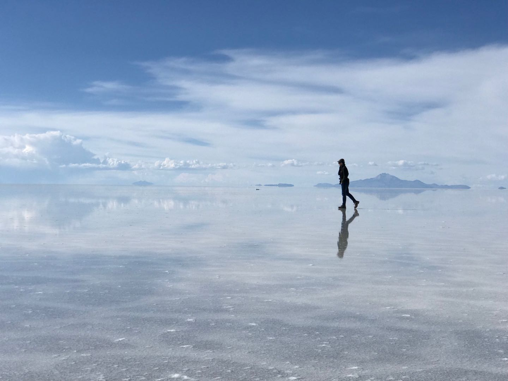
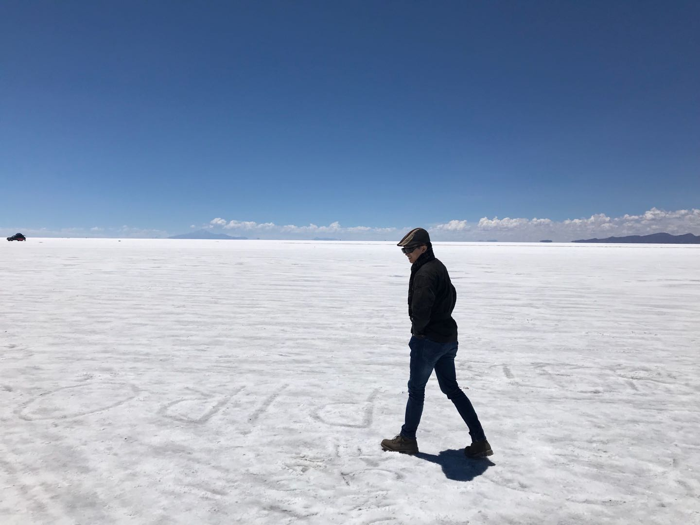

<!--more-->

## 原文

> 有时候
>
> 天空也会想
>
> 撒泡尿照照自己
>
> 有多好看

## 赏析

曾经读过一篇文章，说艺术创作塑造人物时取材于生活不套用模板，才能显得不生硬，其中举了这样一个例子：金老在写天龙八部第11章 [向来痴](http://www.jinyongwang.com/tian/654.html) 时，有一段关于解手精彩的描写，这里就不展开了。段誉等人在船上待久了自然而然会想要解手，而要在写作中注意到这样的细节却不容易，很有可能是金老伏案久了，尿意上来，才多生了这么个妙笔。

本人在盐湖里，方圆几百公里找不到文明的解手场所，因此诗兴大发，运用了比喻以及拟人的修辞手法，把天空拟人化，把盐湖比喻成镜子，生动形象的描绘了天空之境令人神往的优美风景，表达了本人尿急的思想感情/

## 彩蛋

憋得久了，突然想起了朱熹的两句诗，

> 问渠那得清如许，
>
> 为有源头活水来。

也就释然了。

2018年 正月初二

​	